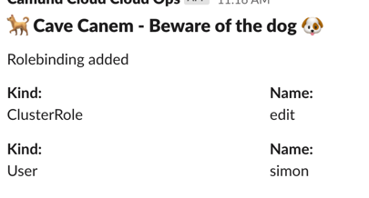
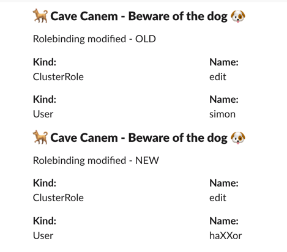
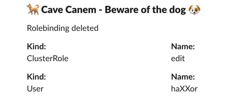

# Cave canem - Beware of the dog

A fun little application that acts as a watchdog for Kubernetes rolebindings.
If something happens on the front porch it starts barking.

## Setup:

1. Set environemnt variable
```
export SLACK_WEBHOOK==https://hooks.slack.com/services/......
```
2. Set kubernetes context (when running out of cluster)
3. Start application `go run .`

Running in-cluster: see lines 35 to 39 and set up rolebinding etc

## Message examples

### Added


### Modified



### Deleted



